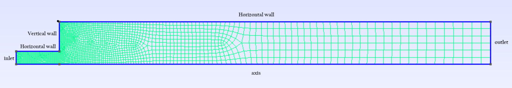

This README documents our review of the article "Absorption and desorption of hydrogen in long metal hydride tank equipped with phase change material jacket" (Rabienataj Darzi et al., International Journal of Hydrogen Energy, April 2016) and outlines our project plan to model similar aspects of hydrogen storage.

#  Review of "Absorption and desorption of hydrogen in long metal hydride tank equipped with phase change material jacket" 

The article titled "**Absorption and desorption of hydrogen in long metal hydride tank equipped with phase change material jacket**" was published in the International Journal of Hydrogen Energy in **April 2016** and was authored by **A. Ali Rabienataj Darzi, H. Hassanzadeh Afrouzi, A. Moshfegh, and M. Farhadi**. We are reviewing this study to understand its findings for application in our own research or project.

This study numerically investigated the **hydrogen absorption and desorption processes** in a long tubular **LaNi5 metal hydride tank (MHT)** integrated with a **Rubitherm phase change material (PCM) jacket** for PEM fuel cell hydrogen supply. The authors analyzed the influence of different **H2 supply pressures (10, 15, and 20 bar)**, different **discharge pressures (1.5, 1.75, and 2 bar)**, and **metal hydride bed porosities (0.4, 0.5, and 0.6)** on transient and local temperature distributions across the H2-MHT system and PCM jacket. The time-dependent changes of the **hydrogen to metal (H/M) ratio** and **PCM melt fraction** were also investigated until equilibrium was reached.

Key findings of the Darzi's Thesis include:

*   It was found that **system temperature, PCM melt fraction, and H/M ratio reach steady state at different rates**. Systems with **higher supply pressure in absorption, lower discharge pressure in desorption, and higher bed porosity** approach steady state faster.
*   The **MHT charges with hydrogen much faster under high supply pressures** and **discharges much faster under lower discharge pressures**.
*   Inserting **metal foam in the PCM jacket enhances thermal conductivity** and **significantly reduces the charging and discharging time**.
*   **PCM melt fraction and H/M ratio reached steady state at different rates during absorption**. The H/M ratio approaches unity (full saturation) quicker at high supply pressures, indicating a shorter charging time.
*   The **full discharge times** during desorption occurred at 300, 420, and 600 minutes for discharge pressures of 1.5, 1.75, and 2 bars, respectively. Systems with lower discharge pressure approach steady state faster.
*   Increasing the **bed porosity led to faster hydrogen charging** but a **decrease in H/M ratio during desorption**. Higher bed porosity leads to a lower PCM melt fraction but faster equilibrium. Lower porosity means a higher amount of hydride mass requiring more heat for release during desorption.
*   Inserting metal foam in the PCM jacket enhances the melting and solidification rate of the PCM, desirably reducing the charging and discharging times.

The study concluded that the operating parameters and bed properties significantly affect system performance, and that integrating metal foam into the PCM is an effective strategy for improving heat transfer and reducing cycle times.

---
# Project Plan

Our work will be structured in three main phases, each focusing on a critical aspect of hydrogen storage modeling, drawing inspiration from the reviewed study and considering its conditions and results.

 ## 1- Convection-Diffusion-Reaction Modeling for Hydrogen Gas and Metal-Oxide Solid Density

* Physics of the Problem:
    * We will model the evolution of hydrogen gas concentration (ρ_g) within the porous bed and the concentration of hydrogen absorbed in the metal hydride tank (ρ_s). This initial model will focus on transport and reaction in a transient regime. We will start with a simplified approach, not fully coupling the temperature.
    * This model aims to capture the fundamental behavior of hydrogen absorption and desorption, including diffusion, convection, and reaction kinetics.

* Coupled Densities Equations:
    * **For the density of the hydrogen gas (ρ_g):**
        ```
        ε ∂ρ_g/∂t = D (∂²ρ_g/∂x² + ∂²ρ_g/∂z²) + u_x ∂ρ_g/∂x + u_z ∂ρ_g/∂z + ṁ(ρ_s, t)
        ```
  * **For the density of hydrogen in the solid metal-oxide `(ρ_s)`:**
        ```
        (1 - ε) ∂ρ_s/∂t = ṁ(ρ_s, t)
        ```

    Where:
    
    * `ρ_g` is the density of the gas (hydrogen). Its value varies as a function of time (`t`) and space (`x`, `z`) as the equation describes its variation. The gas is assumed to behave as an ideal gas. <br>
    * `ρ_s` represents the density of hydrogen in the solid,  it also varies as a function of time (`t`) and space (`x`, `z`). <br>
    * `ε` is the porosity of the bed. This structural property significantly impacts absorption and desorption times, as well as heat transfer. The values used in this study include `0.4`, `0.5`, and `0.6`. <br>
    * `t` is time. <br>
    * `u_x` and `u_z` are the velocities of hydrogen in the longitudinal and radial directions, respectively. These velocities are variables that are obtained by solving the momentum equations. <br>
    * `ṁ(ρ_s, t)` is the mass reaction rate of hydrogen. It represents the mass of hydrogen absorbed or desorbed per unit volume and time. This rate is calculated using separate kinetic equations:
    
    * **For Absorption:**
        ```
        ṁ = C_a exp(-E_a / (RT)) ln(p_g / p_{eq,a}) (ρ_{sat} - ρ_s)
        ```

    * **For Desorption:**
        ```
        ṁ = C_d exp(-E_d / (RT)) (p_g - p_{eq,d}) / p_{eq,d} (ρ_s - ρ_{emp})
        ```
        
        Where:
      
        * `C_a` is the absorption rate coefficient (Value: 59.187 s⁻¹).
      
        * `C_d` is the desorption rate coefficient (Value: 9.57 s⁻¹).
      
        * `E_a` is the activation energy for absorption (Value: 21179.6 J/mol).
      
        * `E_d` is the activation energy for desorption (Value: 16473 J/mol).
      
        * `R` is the universal gas constant (Value: 8.314 J/mole K).
      
        * `T` is Temperature (Variable obtained by solving the heat transfer equation - Equation 10 in Darzie's Thesis).
   
        * `p_g` is Absolute pressure (Variable, see momentum equations).
      
        * `p_{eq,a}` is the equilibrium pressure for absorption and `p_{eq,d}`for desorption, calculated using the Van't Hoff relation: `p_{eq} = p_{ref} exp(A - B/T)` with `A = 10.7`, `B = 3704.6`, and `p_{ref} = 1 MPa` for `p_{eq,a}` and `A = 10.57`, `B = 3704.6`, and `p_{ref} = 1 MPa` for `p_{eq,d}`.
            
        * `ρ_{sat}` is the saturated bed density (Value: 7259 kg/m³).
      
        * `ρ_{emp}` (r_emp) is the density of the metal hydride without hydrogen (empty bed density) (Value: 7164 kg/m³).
      
        * `ρ_s` is the solid bed density (Variable, its evolution is given by an additional equation).
      
But a simplified reaction rate law (e.g., first-order) will be used initially.

      
* Initial and Boundary Conditions:
    * Initial Conditions :
         * Initial Solid Density `ρ_s(t=0)`:
             * Absorption: Initial solid density is equal to the density of the metal hydride bed without hydrogen `ρ_{emp}`
             * Desorption: Initial solid density is equal to the saturated density of the metal hydride bed  `ρ_{sat}`.
         * Initial Temperature `T(t=0)`:
             * Absorption: Initial temperature of the entire system (PCM and MHT tank) is set to 301.15 K.
             * Desorption: Initial temperature of the entire system is set to 305.15 K.
         * Initial Hydrogen Pressure `P(t=0)`: The initial hydrogen pressure is assumed to be equal to the equilibrium pressure at the initial temperature of the system. This equilibrium pressure is calculated using the Van't Hoff equation:
    ```
    Ln(P_{eq}/P_{ref}) = A - B/T
    ```
Where:
* `P_{eq}`: Equilibrium pressure of the MHT.
* `P_{ref}`: Reference pressure (1 MPa).
* `T`: Equilibrium temperature between hydrogen and the MHT.
* `A, B`: Constants specific to the absorption: A = 10.7 et B = 3704.6 - desorption: A = 10.57 et B = 3704.6 process.

For the initial condition of the simulation, the initial hydrogen pressure is assumed to be the equilibrium pressure at the initial system temperature `T (t=0)`. We use the Van't Hoff equation with `T = T_{0}` to calculate this initial pressure `P_{initial} = P_{eq}(T_{initial})`.

Knowing the initial pressure and initial temperature, the initial density of the gaseous hydrogen `ρ_g` can then be determined using the ideal gas law :  `ρ_{g, initial} = P_{initial}/(R_{specific}xT_{initial}`, with R the specific constante of hydrogen gaz : R=4124$ J/mole K.

   * Boundary Conditions:
    
While explicit boundary conditions for the gas phase density `ρ_g` and the solid phase density `ρ_s` are not directly listed, their boundary behavior is inherently linked to those imposed on pressure `P`, temperature `T`, and velocity components `u_x, u_z` used in solving the conservation of mass and momentum equations; however, initial boundary conditions will still be imposed to solve these initial density equations.

Initially, we will assume that `ρ_s` is spatially independent. This is a simplification, as `ρ_s` actually depends on the mass reaction rate `ṁ`, which in turn is a function of temperature and pressure – both of which vary spatially. However, our initial focus will be solely on the first two density equations, employing a simplified form of the mass reaction rate. Consequently, we choose to impose a non-homogeneous Dirichlet boundary condition on `ρ_g` at the left inlet boundary for hydrogen. This absorption case is the first scenario we are testing.

* Implementation in Julia:
    * **Spatial Discretization (Finite Element Method - FEM)**

The spatial discretization of the domain is achieved using the Ferrite.jl library and the Finite Element Method (FEM). The main steps involved are:

1.  *Mesh Generation:* We generate a simple rectangular mesh for testing purposes using the `generate_grid` function in Ferrite.jl. We create a structured quadrilateral mesh over an arbitrary rectangular domain, which serves as the basis for the finite element analysis. For more complex 2D or axisymmetric 3D geometries (intended for later exploration), external tools like Gmsh are used to generate unstructured meshes, which are then imported into Ferrite.jl.

2.  *Definition of Finite Element Spaces:* For each variable in the problem (`ρ_s` represented by `:u1` and `ρ_g` represented by `:u2`), a finite element space is defined using Lagrange elements (`Lagrange{RefQuadrilateral, degree}()`). The `degree` parameter specifies the polynomial order of the basis functions used for interpolation within each element.

3.  *Quadrature Rules:* For the numerical integration of the weak forms of the equations over each element, quadrature rules (`QuadratureRule{RefQuadrilateral}(2*degree+1)`) are defined. The order of the quadrature rule is chosen based on the degree of the polynomials to be integrated to ensure exact or sufficiently accurate integration.

4.  *CellValues:* The `CellValues` objects (`cellvalues_u1` and `cellvalues_u2`) are created for each finite element space and quadrature rule. These objects efficiently compute the values of the basis functions and their gradients at the quadrature points within each cell of the mesh.

5.  *DofHandler (Degrees of Freedom Management):* The `DofHandler` is responsible for associating the degrees of freedom (DOFs) with the nodes of the mesh for each variable. It assigns a unique global index to each DOF, enabling the construction of global solution vectors.

6.  *Assembly of Matrices:* The functions `assemble_mass_matrix` and `assemble_stiffness_matrix` iterate over each cell of the mesh and contribute to the construction of the global mass matrix (`M`) and stiffness matrix (`K`). They utilize the values of the basis functions and their gradients as well as the determinant of the Jacobian (`getdetJdV`), to perform numerical integration over each element.

7.  *Boundary Conditions:* Dirichlet boundary conditions are applied using a `ConstraintHandler` (`ch`). Facet boundaries where the conditions are imposed are defined, and the boundary values are specified (here for `u2` on the "left" boundary).

    * **Numerical Time Integration**
    
The numerical time integration of the system of ordinary differential equations (ODEs) resulting from the spatial discretization is performed using the DifferentialEquations.jl library. The main steps are:

1.  *Definition of the Right-Hand Side (RHS) Function:* The function `rhs!(du, u, p, t)` defines the system of ODEs. It takes as input the time derivatives vector (`du`), the current solution vector (`u`), the problem parameters (`p`), and the current time (`t`). Within this function, boundary conditions are applied, and the time derivatives are computed based on the current solution and the spatial matrices (`K`). The coupling between the variables `u1` and `u2` is also implemented directly within this function with `ṁ`.

2.  *Definition of Initial Conditions:* A vector `uinit` is created and initialized with the initial conditions for all variables across the entire mesh using the `setup_initial_conditions!` function.

3.  *Definition of the Time Span:* The time interval of the simulation (`tspan`) and the final time (`Tend`) are specified.

4.  *Definition of the ODE Problem:* an `ODEProblem` object is created by providing the RHS function (`rhs`), the initial conditions (`uinit`), the time span (`tspan`), and the problem parameters (`p`).

5.  *Choice of Time Stepper:* A time integration solver is chosen to integrate the system of ODEs. In the code, `Rodas5P` is used, which is an implicit solver suitable for stiff problems.

6.  *Solving the Problem:* The `solve` function (or initializing an integrator with `init` and iterating via `intervals`) is used to perform the time integration and obtain the solution `sol` (or the integrator `integrator`).

* Expected Types of Results:
The solution is then processed and visualized, by writing the results to VTK files for visualization with Paraview.

    * Spatiotemporal profiles of hydrogen gas density along the tank.
    * Temporal evolution of the average hydrogen density in the solid.
    * Qualitative comparison of the absorption/desorption rate with Darzi et al.'s results based on parameters like temperature or pressure.

* Ferrite.jl and DifferentialEquations.jl Tutorials:
    * Ferrite.jl:
        * [Ferrite.jl Documentation and Transient Heat Equation](https://ferrite-fem.github.io/Ferrite.jl/stable/tutorials/transient_heat_equation/)
    * DifferentialEquations.jl:
        * [DifferentialEquations.jl Mathematical Specification of an ODE Problem](https://docs.sciml.ai/DiffEqDocs/stable/types/ode_types/#SciMLBase.ODEFunction)


## 2- Laminar Flow Modeling of Hydrogen Gas Through the Reactor

* Physics of the Problem:

We will model the flow of hydrogen gas through the porous bed. Initially, we will consider laminar flow. We aim to determine the gas velocity field (`u_x` and `u_z`) for use in the convection-diffusion-reaction model. We consider the following equations for laminar flow in 2D (x, z), assuming incompressible flow.

         
* **Continuity Equation (Conservation of Mass):**
    ```
    ∂ux/∂x + ∂uz/∂z = 0
    ```

* **Momentum Equation (Conservation of Momentum):**

    * *x-momentum equation:*
      ```
      ρg ( ∂ux/∂t + ux ∂ux/∂x + uz ∂ux/∂z ) = -∂p/∂x + μ ( ∂²ux/∂x² + ∂²ux/∂z² ) - Sx
      ```

    * *z-momentum equation:*
      ```
      ρg ( ∂uz/∂t + ux ∂uz/∂x + uz ∂uz/∂z ) = -∂p/∂z + μ ( ∂²uz/∂x² + ∂²uz/∂z² ) - Sz
      ```

   Where:
   * `ux` and `uz` are the unknown velocity components in the x and z directions, respectively.
   * `ρg` is the density of the gas phase, we will use the value of  the initial density of the gaseous hydrogen (see Boundary Conditions of section 1)
   * `t` is time.
   * `x` and `z` are the spatial coordinates.
   * `p` is the unkown pressure.
   * `μ` is the dynamic viscosity of the gas phase, `μ = 8.4e-6` kg/(m s)).
   * `Sx` and `Sz` representing the pressure loss in the bed due to viscous dissipation, `Si` in each direction is calculated by: `Si= ui(mu/K)`
     `K` denotes the permeability of the porous bed, with `K = 10^{-9} \, m^2`.
   

* Boundary and Initial Conditions (Adapted from Darzi et al.):
    * Initial Conditions
         *  Initial Temperature `T(t=0)` and Initial Pressure are the same than in Section 1.

    * Boundary Conditions
         * Inlet (`z = -L_{in}`, `0 \leq x \leq R_{in}`):
             * Pressure is defined as the supply pressure ($P_{in}$) - 10, 15, and 20 bar - for absorption or the discharge pressure ($P_{out}$) - 1.5, 1.75, and 2 bar - for desorption.

         * *Vertical Wall (`z = 0`, `R_{in} \leq x \leq R`)*
             * Hydrogen velocities are zero: `u_x = 0, u_z = 0`.
             * No-slip condition at a solid, impermeable wall.
         * *Horizontal Wall (`x = R_{in}`, `-L_{in} \leq z \leq 0` and `x = R`, `0 \leq z \leq L`):*
             * Hydrogen velocities are zero: `u_x = 0, u_z = 0`.
             * No-slip condition at solid, impermeable walls.
         * *Outlet (`z = L`, `0 \leq x \leq R`):*
              * Hydrogen velocities are zero: `u_x = 0, u_z = 0`.
              * Assuming no flow out of the defined domain at this boundary for this initial Navier-Stokes solve.
         * *Axis (`x = 0`, `-L_{in} \leq z \leq L`)*
              * `u_x = 0`, `\frac{\partial u_z}{\partial x} = 0`.
              * Symmetry condition representing the axis of the original cylindrical geometry, enforcing no flow across and symmetric tangential velocity.  

* Implementation in Julia:
      * **Spatial Discretization (Finite Element Method - FEM)**

 1. *Mesh Generation:* To simulate transient laminar flow in a cylindrical tank with nozzle (in similar project this will become cylindrical cavity with periodically oscillating lid (or cover)). The mesh required on input is generated using GMSH.
 


 2. *Definition of Finite Element Spaces:* Finite element spaces are defined for velocity (:v) and pressure (:p). For velocity, higher-order Lagrange elements (Lagrange{RefQuadrilateral, 2}()^dim) are used. For pressure, lower-order Lagrange elements (Lagrange{RefQuadrilateral, 1}()) are used. This means that for velocity (v), there are 9 x 2 = 18 degrees of freedom (`DofHandler`) per element (since it's a vector field in 2D), and for pressure (p), there are 4 DOFs per element.  The total is then 18 + 4 = 22 DOFs per element.
For the numerical integration of weak forms of equations on each element, quadrature rules (QuadratureRule{RefQuadrilateral}(5)) are defined."

 3. *CellValues:* `CellValues` objects (`cellvalues_v` and `cellvalues_p`) are created for the velocity and pressure finite element spaces and the quadrature rule. These objects efficiently calculate basis function values and their gradients at quadrature points within each mesh cell.
  
 4. *Boundary conditions:* First, consider the axis as a wall, imposing a no-slip condition (zero velocity) using the ConstraintHandler `ch`. The boundary conditions are then enforced during time integration through the `ferrite_limiter!(u, _, p, t)` function.
   
 5. *Matrix Assembly:* The code assembles the global mass matrix (M). Dealing only with v, we create blocks Mvv, Mvp, Mpv, and Mpp.
Then, the stiffness matrix (K) is assembled, implementing 3 blocks:
* Block `A`: Viscous term + Porous media term (acting on velocity)
* Block `Bᵀ`: Pressure term (acting on the momentum equation)
* Block `B`: Incompressibility term (acting on the velocity equation)
* The last block is zero because there are no direct pressure-pressure terms in the momentum equation.
Finally, the matrices are allocated and assembled.

   * **Numerical Time Integration**

Numerical time integration of the system of ordinary differential equations (ODE) resulting from spatial discretization is performed using the `DifferentialEquations.jl` library. The main steps are as follows:

 1. *Initial condition:* A vector `u0` is created and initialized with the initial conditions for velocity and pressure on the entire mesh using the function `setup_initial_conditions!` with `apply_analytical` used on v and p.

 2. *Right hand side:* `RHSparams` struct: Defines the parameters needed for the Navier-Stokes right-hand side function, including matrices, constraint handlers, and cell values.  `ferrite_limiter!` applies boundary conditions at each time step. `navierstokes_rhs_element!` calculates the contribution of the convective term to the time derivative of velocity for a single element.  `navierstokes!` calculates the right-hand side of the ODE system, including linear and nonlinear terms, and applies boundary conditions.
`navierstokes_jac_element!` calculates the element-wise contribution to the Jacobian matrix, representing the variation of the nonlinear term. `navierstokes_jac!` assembles the global Jacobian matrix, including the linear part and the variation of the nonlinear term, and applies boundary conditions.
 
 3. *Time integration:* An `ODEProblem` is created using the `navierstokes!` function and its Jacobian. A `Rodas5P` time stepper is initialized with error tolerances. The time integration loop iterates through steps, saving VTK files at each step for visualization in ParaView.  A ParaView collection is used to group the VTK files.


* Expected Types of Results:
    * Pressure, velocity, and temperature fields.
    * Flow rate as a function of pressure drop.
    * Impact of porosity and permeability on flow and heat transfer.
    * Temperature distribution within the reactor.

* Ferrite.jl and DifferentialEquations.jl Tutorials:
    * [Ferrite.jl](https://ferrite-fem.github.io/Ferrite.jl/stable/)
    * [DifferentialEquations.jl](https://docs.sciml.ai/DiffEqDocs/stable/)
    * [GMSH.jl](https://github.com/JuliaFEM/Gmsh.jl)
    * [Incompressible Navier-Stokes equations via DifferentialEquations.jl](https://ferrite-fem.github.io/Ferrite.jl/stable/tutorials/ns_vs_diffeq/). 

## 3- Combination of the Two Models (Coupling)**

* Coupling Approach:
    * We will explore coupling the convection-diffusion-reaction model with the flow and energy models.
    * **One-Way Coupling (Initial):**
        1.  Solve the flow model (including energy) to obtain the velocity field (v_g) and temperature field (T).
        2.  Use v_g and T in the convection and reaction terms of the mass and energy conservation equations in the convection-diffusion-reaction model.
        3.  The mass reaction rate (ṁ) depends on ρ_g, ρ_s, and T.
    * **Two-Way Coupling (Advanced):**
        1.  Iteratively solve all models, exchanging information (e.g., pressure and temperature changes from reaction affecting flow and heat transfer).
        2.  Include density and energy changes from the reaction (ṁ and heat release/absorption) in the flow and energy model's mass and energy conservation equations.

* Coupled Iterations or Time Steps:
    * Sequential or iterative coupling within/between time steps.

* Integration of Thermal Effects (Now Integrated):
    * The energy equation is now a fundamental part of the flow model and will be coupled with the convection-diffusion-reaction model.

**Expected Results of the Coupled Model:**

* Spatiotemporal evolution of hydrogen gas (ρ_g) and solid (ρ_s) densities, temperature (T), and velocity (v_g), considering the flow and heat transfer, aiming to qualitatively reproduce trends observed by Darzi et al. regarding the impact of pressure, porosity, and temperature.
* Predictions of storage capacity, cycle times, and temperature distributions.
    
